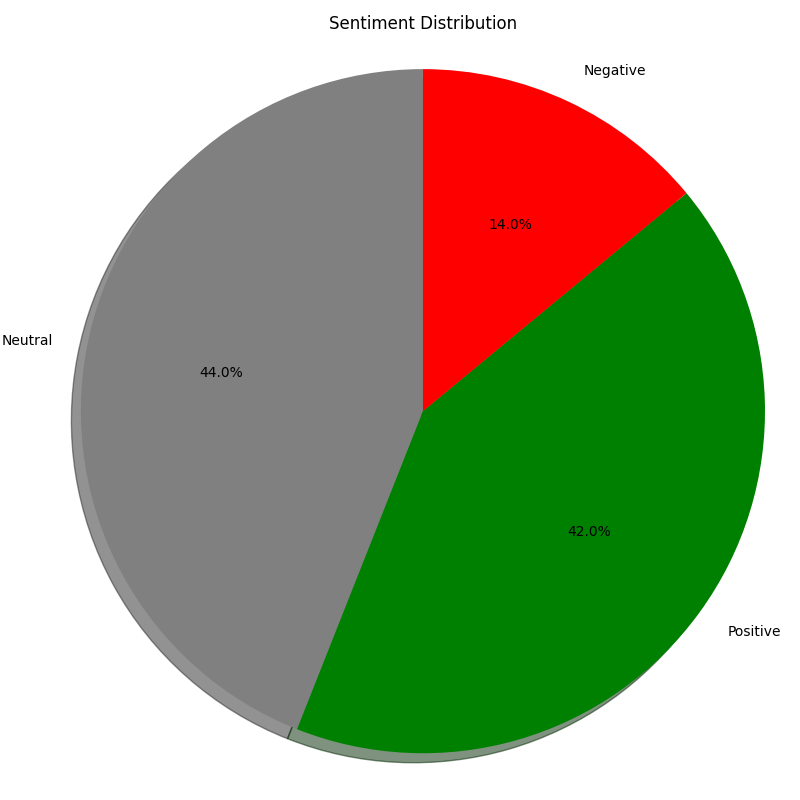
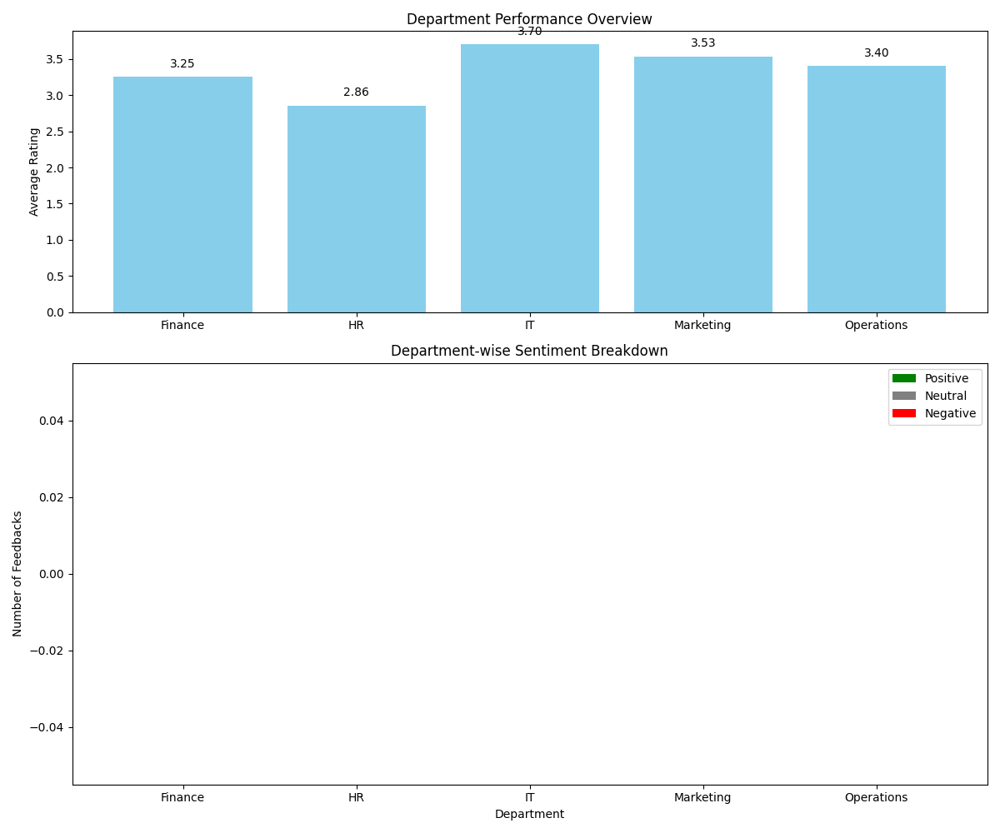
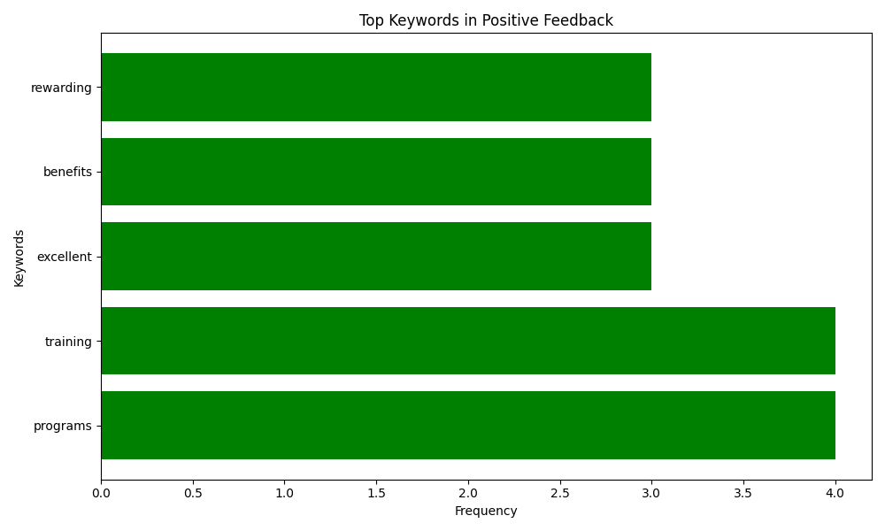
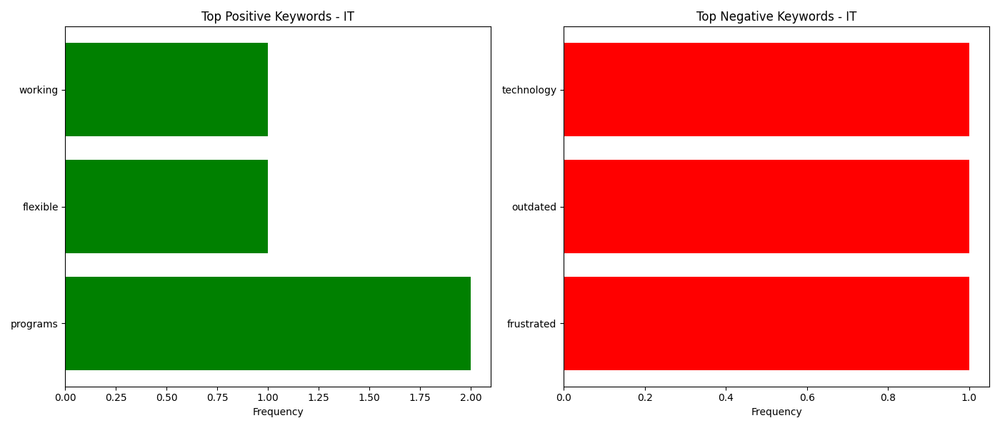

## Project Description

The Employee Feedback Analyzer is a Python-based tool designed to analyze employee feedback data, perform sentiment analysis, and generate comprehensive reports with visualizations. This tool helps organizations gain insights from employee feedback by identifying sentiment patterns, extracting key topics, and visualizing department-wise performance metrics.

The system processes feedback data, categorizes sentiments as positive, negative, or neutral using TextBlob's natural language processing capabilities, and generates various charts and reports to help management understand employee satisfaction across different departments.

## Features

-   Feedback Data Generation  : Creates dummy feedback data for testing and demonstration
-   Sentiment Analysis  : Analyzes feedback text to determine positive, negative, or neutral sentiment
-   Keyword Extraction  : Identifies most common words in feedback by sentiment category
-   Department-wise Analysis  : Breaks down feedback by department for targeted insights
-   Comprehensive Visualizations  : Generates multiple charts and graphs including:
  - Sentiment distribution (pie and bar charts)
  - Rating distribution
  - Department-wise sentiment analysis
  - Department performance metrics
  - Keyword frequency analysis
  - Department-specific keyword analysis
  - Interactive Department Selection  : Filter analysis by specific departments
  - Report Generation  : Creates JSON, CSV, and visual reports

## Installation

1. Clone the repository:
      
   git clone <repository-url>
   cd employee-feedback-analyzer
      

2. Create and activate a virtual environment (recommended):
      
   python -m venv venv
   # On Windows
   venv\Scripts\activate
   # On macOS/Linux
   source venv/bin/activate
      

3. Install the required dependencies:
      
   pip install -r requirements.txt
      

## How to Run

1. Run the main application:
      
   python main.py
      

2. The program will:
   - Generate dummy feedback data in  data/feedback.csv 
   - Perform sentiment analysis and save results to  data/feedback_with_sentiment.csv 
   - Generate reports and visualizations in the  reports  folder
   - Prompt you to select a specific department for analysis (optional)

3. Command-line options:
      
   # Run with versioned reports (includes timestamp)
   python main.py --versioned
   
   # Run with a specific department filter
   python main.py --department IT
      

4. View the generated reports in the  reports  folder

## Sample Screenshots

### Sentiment Distribution

### Department Performance Insights

### Keyword Analysis

### Department-specific Keywords

## Project Structure

-  main.py : Main application entry point
-  src/ 
  -  analyzer.py : Core analysis functions including keyword extraction
  -  data_generation.py : Generates dummy feedback data
  -  report_generator.py : Creates visualizations and reports
  -  sentiment_analyzer.py : Performs sentiment analysis using TextBlob
-  data/ : Contains generated feedback data
-  reports/ : Contains generated reports and visualizations

## Dependencies

See  requirements.txt  for a complete list of dependencies. Key libraries include:

- pandas: Data manipulation and analysis
- matplotlib: Data visualization
- textblob: Natural language processing and sentiment analysis
- nltk: Natural language toolkit for keyword extraction

## Future Enhancements

- Add real-time feedback collection interface
- Implement more advanced NLP techniques for better sentiment analysis
- Create interactive dashboard for exploring feedback data
- Add trend analysis to track changes over time
- Implement user authentication for accessing reports